## UAV Control Projects

This project was implemented in the Fall semester of UNIST 2019 UAV Navigation & Flight Computer.

Project 1's C/A Code generator referenced Chapter 5 of the Fundamentals of Global Positioning System Receivers book, 

and Project 2's overall closed-loop system design referenced the course pdf slide.

### Project1

#### 1. C/A Code generator implementation example

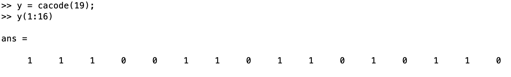

#### 2. Auto-correlation, Cross-correlation implementation example

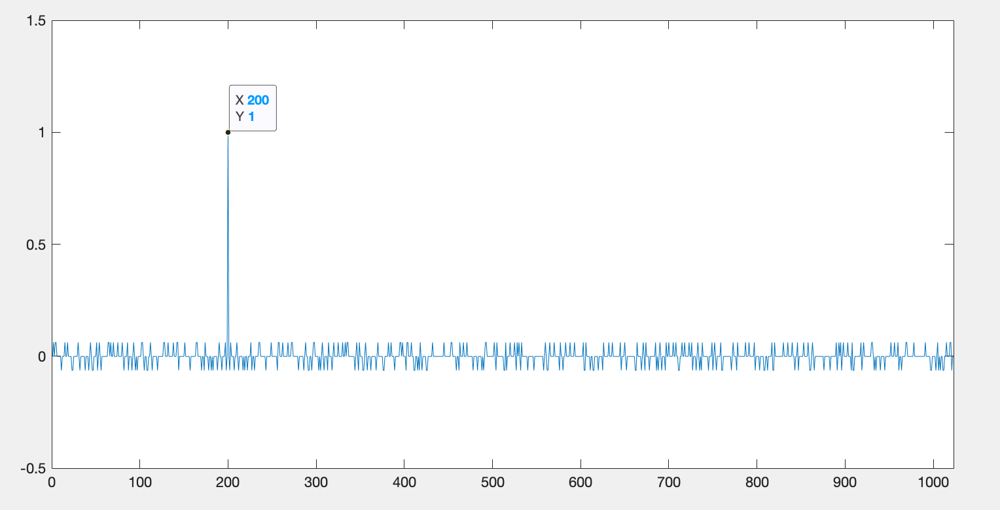{: width="60%"}

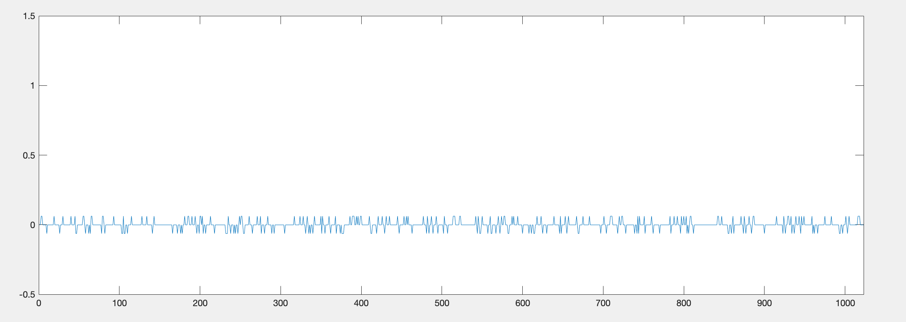{: width="60%"}

### Project2

#### 1. Problem situation

UGV control simulation with closed-loop system in 2D

When entering the destination, control the wheel motor to move to the corresponding point and perform parallel parking

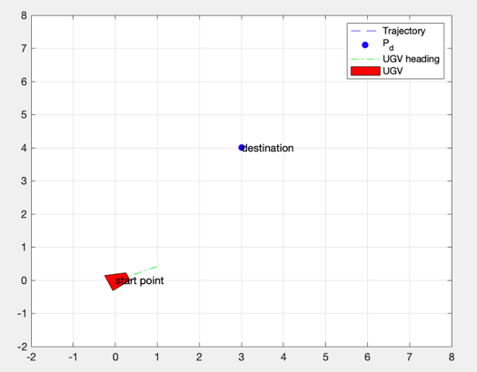

#### 2. Control system design

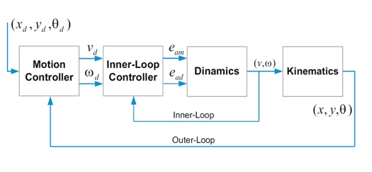

#### 3. Results

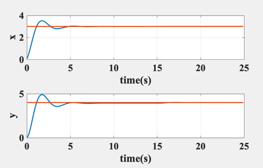

### Project3

#### 1. Problem situation

UAV stabilizing simulation with closed-loop system in 2D (Fixed on the rod)

When entering the angle phi, control the propeller motor to perform stabilizing

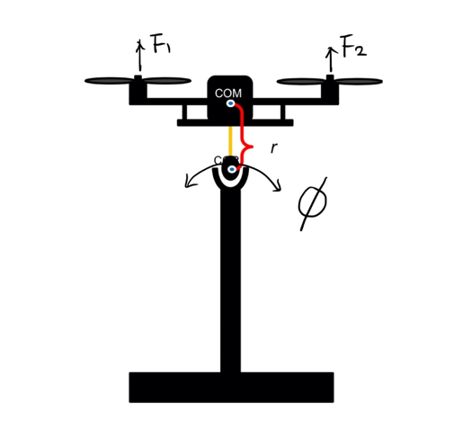

#### 2. Control system design

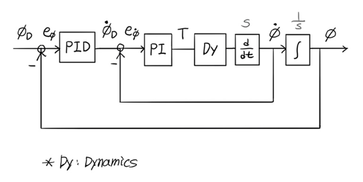

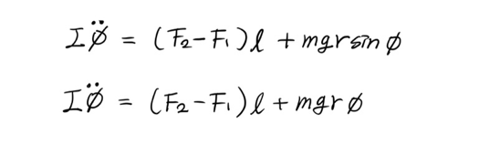

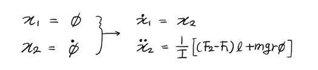

#### 3. Results

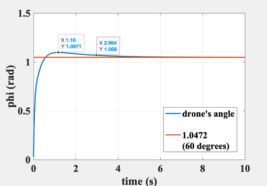

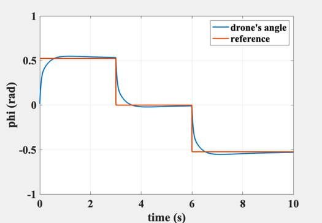

### Reference

Fundamentals of Global Positioning System Receivers - A Software Approach (James Bao‐Yen Tsui) chapter5
